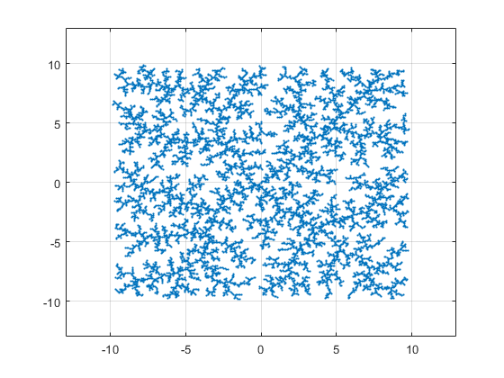
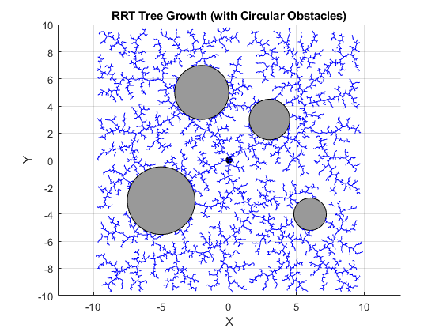
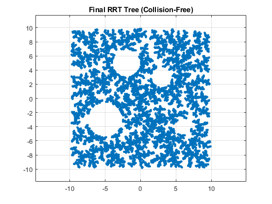
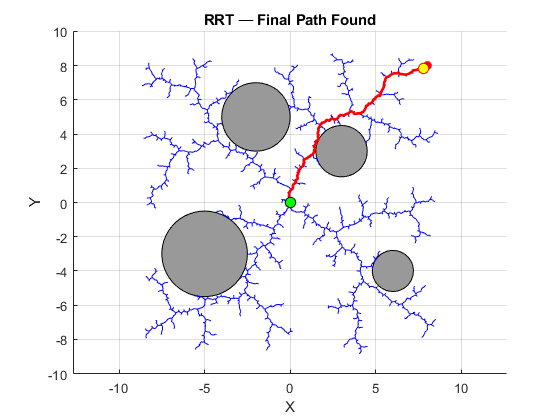

# Gradual Implementation of Rapidly-exploring Random Tree (RRT) from Scratch

**Rabah Louali,** <rabah.louali@gmail.com>, Dec. 2025. 

**Keywords:** matlab, robotics, path-planning, rrt-algorithm.

[📄 Download the Full PDF Report](docs/RRT_from_Scratch.pdf)


## **1. Global Goal**
This project provides a step-by-step implementation of the Rapidly-exploring Random Tree (RRT) algorithm. The implementation is designed to be gradual, starting from a basic algorithm and incrementally adding features such as animation, collision detection, and pathfinding.

This resource is oriented toward:

- **Students:** Those wishing to learn the RRT algorithm via a clear, simple implementation.
- **Researchers:** Those needing a bare-bones RRT structure to customize for specific requirements.

The code is written in **MATLAB**, but the logic is kept simple to facilitate translation into other languages (Python, C++, etc.).

Collision detection is handled using **continuous edge-checking** against circular obstacles. By utilizing vector projection rather than discrete sampling, the algorithm guarantees collision-free paths with minimal computational overhead ( per obstacle), making it ideal for educational prototyping.


## **2. Steps of Implementation**

1. **Simple RRT:** Basic tree generation.
1. **Animation:** Visualizing tree growth in real-time.
1. **Collision Detection:** Checking for obstacles before adding edges.
1. **Goal Detection & Pathfinding:** Stopping when the goal is reached and backtracking to find the optimal path.


## **3. Simple RRT Algorithm**

### **Pseudocode[^1]**

**Input:**  
- Initial configuration (q_init)
- Number of vertices (K)  
- Incremental distance (Δq)

**Output:**  
- RRT graph \( G \)

```pseudo
BuildRRT(q_init, K, Δq):
    G.init(q_init)

    for k = 1 to K do
        q_rand ← RAND_CONF()
        q_near ← NEAREST_VERTEX(q_rand, G)
        q_new  ← NEW_CONF(q_near, q_rand, Δq)
        G.add_vertex(q_new)
        G.add_edge(q_near, q_new)
    return G
```

- "<b>RAND_CONF</b>" grabs a random configuration <i>q<sub>rand</sub></i> in <i>C</i>. This may be replaced with a function "<b>RAND_FREE_CONF</b>" that uses samples in <i>C<sub>free</sub></i>, while rejecting those in <i>C<sub>obs</sub></i> using some collision detection algorithm.
- "<b>NEAREST_VERTEX</b>" is a function that runs through all vertices <i>v</i> in graph <i>G</i>, calculates the distance between <i>q<sub>rand</sub></i> and <i>v</i> using some measurement function thereby returning the nearest vertex.
- "<b>NEW_CONF</b>" selects a new configuration <i>q<sub>new</sub></i> by moving an incremental distance <i>Δq</i> from <i>q<sub>near</sub></i> in the direction of <i>q<sub>rand</sub></i>. 


### **MATLAB Implementation**
*(See RRT\_Basic.m in repository)*


### **RESULTS**




## **4. RRT Animation**
Visualizing the growth of the tree helps in understanding how RRT explores the configuration space.


**MATLAB Implementation**

*(See RRT\_Animated.m in repository for the implementation featuring real-time plotting).*


## **5. Collision Detection**
It is crucial to verify that the edge \( [q_{\text{near}}, q_{\text{new}}] \) does not collide with obstacles.

### **5.1. Obstacle Representation: Rectangular vs. Circular**
Choosing the right shape for obstacles is a key design decision.

||**Rectangular Obstacles**|**Circular Obstacles**|
| :- | :- | :- |
|**Pros**|<p>- Easy to define (x, y, width, height);</p><p>- Matches indoor environments (walls, rooms); </p><p>- Easy to load from grid maps.</p>|<p>- Simple collision math (Euclidean distance);</p><p>- Smooth geometry; efficient randomization.</p>|
|**Cons**|<p>- Corner collision checking is complex;</p><p>- Less realistic for unstructured outdoor environments.</p>|- Harder to model flat obstacles accurately.|
|**Best For**|Indoor robotics, warehouse navigation, floor-plan-based maps.|Outdoor navigation (trees, poles), aerial robots, and fast simulation/research.|

**Note:** This implementation uses **Circular Obstacles** for mathematical simplicity and performance.


### **5.2. Collision Detection Algorithm (Circle)**
**Goal:** Check if the segment \( [q_{\text{near}}, q_{\text{new}}] \) intersects a circle defined by center and radius (r). 

**Steps:**

1. Compute vector quantities:

$$
\vec{v} = q_{\text{new}} - q_{\text{near}}
$$

$$
\vec{w} = \text{center} - q_{\text{near}}
$$


2. Project the center onto the line segment

$$
t = \frac{\vec{w} \cdot \vec{v}}{\vec{v} \cdot \vec{v}}
$$


3. Determine the closest point (h) on the segment:

$$
\text{If } 0 \le t \le 1: \quad h = q_{\text{near}} + t \cdot \vec{v}
$$

$$
\text{If } t < 0: \quad h = q_{\text{near}}
$$

$$
\text{If } t > 1: \quad h = q_{\text{new}}
$$

4. Check distance:

$$
\text{If } \| h - \text{center} \| \le r \quad \Rightarrow \text{Collision}
$$

$$
\text{Otherwise} \quad \Rightarrow \text{Free}
$$

### **RESULTS**





## **6. Goal Detection and Path Extraction**
RRT is generally categorized into two types based on the goal:

||**Online RRT (Single-Query)**|**Offline RRT (Multi-Query/Roadmap)**|
| :- | :- | :- |
|**Principle**|The algorithm runs until the tree gets sufficiently close to a specific goal qnew, then backtracks to find the path.|The algorithm builds a massive graph covering the entire space first. Paths are queried later using Dijkstra or A\*.|
|**Best For**|This is best for dynamic scenarios or high-dimensional manipulation.|Good when many queries in the same map, but Requires precomputation|

**Note:** This implementation uses **Online RRT:** 

- **Stop Condition:** The loop breaks when a node is added such that qnew-qGoal≤ϵ.
- **Backtracking:** Using the graph structure, we trace the parents from the goal node back to the start node to reconstruct the path.


## **7. Complete Integrated Code**
This script combines animation, circular collision checking, and goal detection.

### **MATLAB Implementation**

*(See RRT\_Animated\_Circular\_Obstacles\_Goal\_Detection.m in repository)*

```matlab
%% RRT with Goal Detection, Collision Checking, and Path Extraction
clear all; close all; clc;

%% Parameters
q_init = [0, 0];          % Initial configuration
q_goal = [8, 8];          % Goal configuration
goal_threshold = 0.3;     % Distance threshold for declaring goal reached

K = 10000;                % Maximum RRT iterations
Dq = 0.1;                 % Step size

q_max = [10, 10];
q_min = [-10, -10];

%% Define circular obstacles: [x_center, y_center, radius]
obstacles = [
    3,  3,  1.5;
   -2,  5,  2.0;
    6, -4,  1.2;
   -5, -3,  2.5
];

%% Initialize graph
G = graph();
G = addnode(G, table(q_init(1), q_init(2), 'VariableNames', {'X', 'Y'}));
idx_init = 1;

%% Setup Figure
figure;
hold on;
axis([q_min(1) q_max(1) q_min(2) q_max(2)]);
axis equal;
grid on;
title('RRT Tree Growth (Goal Detection Enabled)');
xlabel('X');
ylabel('Y');

% Plot start and goal
plot(q_init(1), q_init(2), 'ko', 'MarkerFaceColor', 'k', 'MarkerSize', 6);
plot(q_goal(1), q_goal(2), 'ro', 'MarkerFaceColor', 'r', 'MarkerSize', 6);

% Plot obstacles
theta = linspace(0, 2*pi, 50);
for i = 1:size(obstacles,1)
    cx = obstacles(i,1); cy = obstacles(i,2); r = obstacles(i,3);
    fill(cx + r*cos(theta), cy + r*sin(theta), [0.6 0.6 0.6], 'EdgeColor','k'); 
end

%% =============================
%%       MAIN RRT LOOP
%% =============================
goal_reached = false;
idx_goal_node = -1;

for i = 1:K

    %% 1. Random sample
    q_rand = [
        q_min(1) + (q_max(1) - q_min(1)) * rand, ...
        q_min(2) + (q_max(2) - q_min(2)) * rand
    ];

    %% 2. Find nearest existing vertex
    coords = [G.Nodes.X, G.Nodes.Y];
    [~, idx_nearest] = min(vecnorm(coords - q_rand, 2, 2));
    q_nearest = coords(idx_nearest,:);

    %% 3. Compute q_new
    direction = q_rand - q_nearest;
    dist = norm(direction);

    if dist < Dq
        q_new = q_rand;
    else
        q_new = q_nearest + (Dq/dist)*direction;
    end

    %% 4. Collision checking
    collision = false;
    for j = 1:size(obstacles,1)
        center = obstacles(j,1:2);
        r = obstacles(j,3);
        if ~collisionCircle(q_nearest, q_new, center, r)
            collision = true;
            break;
        end
    end
    if collision
        continue;
    end

    %% 5. Safe → Add node + edge
    G = addnode(G, table(q_new(1), q_new(2), 'VariableNames', {'X','Y'}));
    idx_new = numnodes(G);
    G = addedge(G, idx_nearest, idx_new);

    %% 6. Animate edge
    plot([q_nearest(1), q_new(1)], [q_nearest(2), q_new(2)], 'b-');
    drawnow limitrate;

    %% 7. Goal detection
    if norm(q_new - q_goal) < goal_threshold
        disp('🎯 Goal reached!');
        goal_reached = true;
        idx_goal_node = idx_new;
        break;
    end
end

%% =============================
%%       PATH EXTRACTION
%% =============================
if goal_reached
    disp('Backtracking path using shortestpath...');

    path = shortestpath(G, idx_init, idx_goal_node);

    % Extract coordinates
    px = G.Nodes.X(path);
    py = G.Nodes.Y(path);

    % Highlight final path
    plot(px, py, 'r-', 'LineWidth', 2);
    plot(px(1), py(1), 'ko', 'MarkerFaceColor','g', 'MarkerSize', 8);
    plot(px(end), py(end), 'ro', 'MarkerFaceColor','y', 'MarkerSize', 8);

    title('RRT — Final Path Found');

else
    disp('⚠ Goal NOT reached within iteration limit.');
end

```


### **RESULTS**




## **8. Conclusion**

This implementation demonstrates the core mechanics of RRT:

1. **Grows** a random tree.
1. **Avoids** circular obstacles using vector projection.
1. **Detects** the goal state.
1. **Reconstructs** the valid path.

**Future Improvements:**\
To further enhance this planner, consider implementing:

- **Path Smoothing:** Post-process the path to remove jagged edges.
- **RRT-Connect:** Grow two trees (from start and goal) to meet in the middle (significantly faster).
- ***RRT (RRT-Star):*\*** Optimize the path length asymptotically.

[^1]: [Rapidly exploring random tree - Wikipedia](https://en.wikipedia.org/wiki/Rapidly_exploring_random_tree) 
